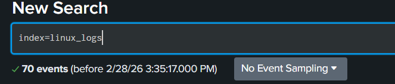
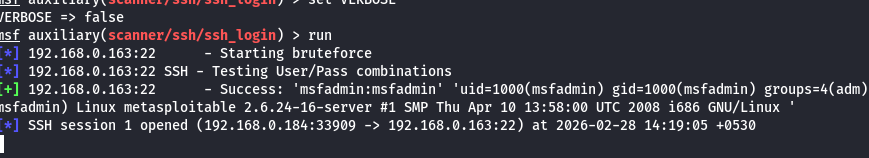
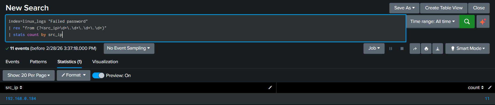
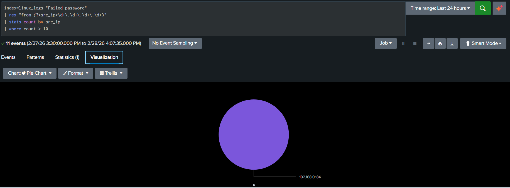
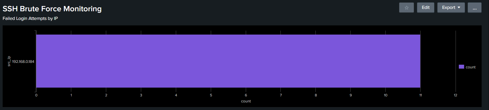
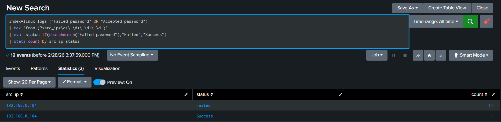

# 🛡️ SSH Brute Force Detection Using Splunk

## 📌 Project Overview

This project demonstrates detection of SSH brute force attacks using Splunk Enterprise by analyzing Linux authentication logs generated in a controlled lab environment.

The detection logic identifies:

Multiple failed SSH login attempts

Suspicious attacking IP addresses

Successful login after repeated failures (possible compromise)

Threshold-based alert generation

This simulates a real-world SOC (Security Operations Center) investigation workflow.

## 🎯 Objectives

Ingest Linux authentication logs into Splunk

Extract attacker IP addresses using regex

Detect brute force attempts using threshold logic

Identify potential account compromise

Create a monitoring dashboard

Configure real-time alerting

Map detection to MITRE ATT&CK framework

| Component         | Details                           |
| ----------------- | --------------------------------- |
| Attacker Machine  | Kali Linux                        |
| Target Machine    | Metasploitable 2                  |
| SIEM              | Splunk Enterprise                 |
| Log Source        | `/var/log/auth.log`               |
| Service Monitored | SSH (Port 22)                     |
| Network Type      | Private Lab Network (192.168.x.x) |

Note: All IP addresses used in this project belong to a private RFC1918 lab environment.

## 🔎 Detection Methodology

### 1️⃣ Identify Failed SSH Login Attempts

``index=linux_logs "Failed password"``

### 2️⃣ Extract Attacker IP Address

``index=linux_logs "Failed password"
| rex "from (?<src_ip>\d+\.\d+\.\d+\.\d+)"
| stats count by src_ip
| where count > 10``

This extracts source IP addresses and counts failed attempts

### 3️⃣ Apply Threshold-Based Detection

``index=linux_logs "Failed password"
| rex "from (?<src_ip>\d+\.\d+\.\d+\.\d+)"
| stats count by src_ip
| where count > 10``

Any IP exceeding 10 failed attempts is flagged as suspicious.

### 4️⃣ Detect Successful Login After Repeated Failures

``index=linux_logs ("Failed password" OR "Accepted password")
| rex "from (?<src_ip>\d+\.\d+\.\d+\.\d+)"
| eval status=if(searchmatch("Failed password"),"Failed","Success")
| stats count by src_ip status``

This helps determine whether the brute force attack resulted in successful authentication.

## 📊 Dashboard Components

A Splunk dashboard was created containing:

Failed login attempts by IP (Bar Chart)

Failed vs Successful login distribution (Pie Chart)

Login attempts over time 

This provides continuous monitoring capability.

## 🚨 Alert Configuration

Alert Details:

Trigger Condition: Failed attempts > 10

Schedule: Every 5 minutes

Action: Generate alert when results > 0

This simulates near real-time brute force detection in a SOC environment.

## 🧠 MITRE ATT&CK Mapping

| Technique   | ID    | Tactic            |
| ----------- | ----- | ----------------- |
| Brute Force | T1110 | Credential Access |

This detection aligns with the MITRE ATT&CK framework under Credential Access.

---

## 📸 Screenshots

### 🔹 1. Raw Log Evidence

Shows multiple failed SSH login attempts in Linux authentication logs.

---

2️⃣ Attack Running

Bruteforce Attack

---

### 🔹 2. IP Extraction Using Regex

Extracted attacker IP addresses using SPL `rex` command.

---

### 🔹 3. Threshold-Based Brute Force Detection

Identifies IP addresses exceeding defined failed login threshold.

---

### 🔹 4. Monitoring Dashboard

Bar chart visualization of failed login attempts by IP.

---

### 🔹 5. Failed vs Successful Login Distribution

Shows authentication success vs failure ratio.

---

## 🛠️ Skills Demonstrated

- Log Analysis
- SPL (Search Processing Language)
- Regex Extraction
- Threshold-based Detection Logic
- Dashboard Creation
- Alert Engineering
- MITRE ATT&CK Mapping
- SOC Investigation Workflow

# 🎓 Conclusion

This project demonstrates practical SOC-level detection engineering using Splunk to identify SSH brute force attacks in a controlled lab environment.

It highlights hands-on experience in log analysis, threat detection, and security monitoring.
